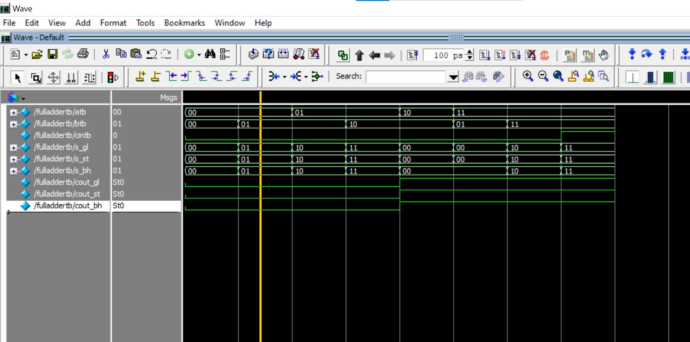
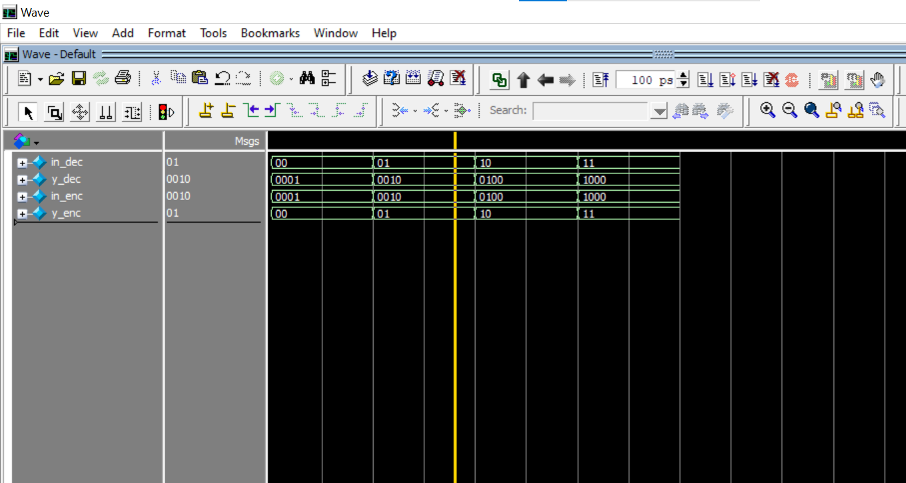
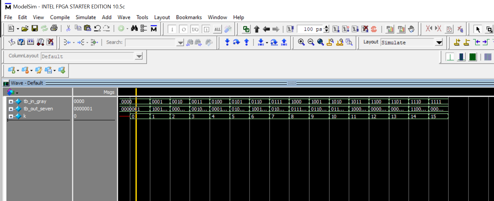
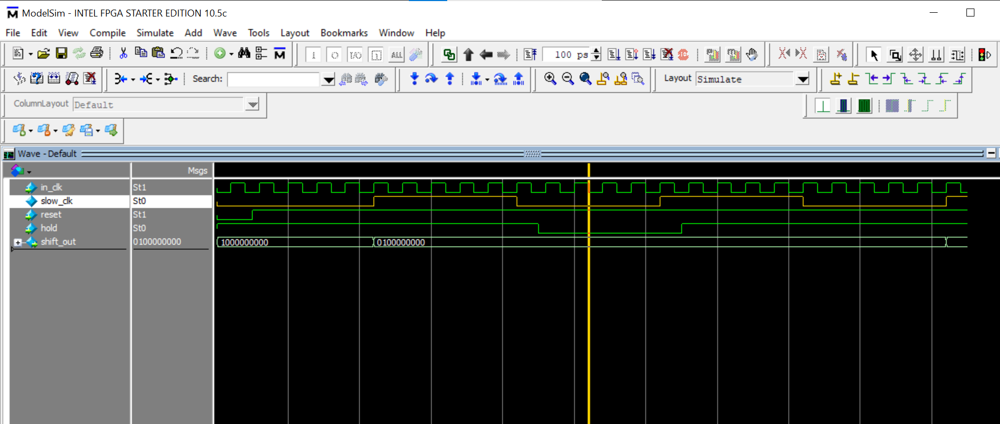

# NTI-Verilog-Projects
Digital Design and Verilog HDL projects completed during the training program at the National Telecommunication Institute (NTI), Egypt. Includes RTL design, testbenches, and simulation for various digital systems.

## 1. 2-Bit Full Adder
* **Description:** Designed and simulated a 2-bit full adder logic circuit in Verilog using Gate-Level, Structural, and Behavioral modeling.

* **Simulation Waveform:**
  

* **Simulation Transcript:**
```text
Time=0  | a=00 b=00 cin=0 | GL: s=00 cout=0 | ST: s=00 cout=0 | BH: s=00 cout=0
Time=10 | a=00 b=01 cin=0 | GL: s=01 cout=0 | ST: s=01 cout=0 | BH: s=01 cout=0
Time=20 | a=01 b=01 cin=0 | GL: s=10 cout=0 | ST: s=10 cout=0 | BH: s=10 cout=0
Time=30 | a=01 b=10 cin=0 | GL: s=11 cout=0 | ST: s=11 cout=0 | BH: s=11 cout=0
Time=40 | a=10 b=10 cin=0 | GL: s=00 cout=1 | ST: s=00 cout=1 | BH: s=00 cout=1
Time=50 | a=11 b=01 cin=0 | GL: s=00 cout=1 | ST: s=00 cout=1 | BH: s=00 cout=1
Time=60 | a=11 b=11 cin=0 | GL: s=10 cout=1 | ST: s=10 cout=1 | BH: s=10 cout=1
Time=70 | a=11 b=11 cin=1 | GL: s=11 cout=1 | ST: s=11 cout=1 | BH: s=11 cout=1
```
## 2. Decoder & Encoder
* **Description:** Implemented a parameterized 2-to-4 Decoder and 4-to-2 Encoder in Verilog using procedural for loops.

* **Simulation Waveform:**
  

* **Simulation Transcript:**
```text
DEC: in=00 y=0001 | ENC: in=0001 y=00
DEC: in=01 y=0010 | ENC: in=0010 y=01
DEC: in=10 y=0100 | ENC: in=0100 y=10
DEC: in=11 y=1000 | ENC: in=1000 y=11
```
---

## 3. Gray Code to 7-Segment Decoder
* **Description:** Designed a hierarchical module that converts Gray Code input to Binary using a parametric generate loop, and drives a Common Anode 7-Segment display.

* **Simulation Waveform:**
  

* **Simulation Transcript:**
```text
Time = 0 | Gray Input = 0000 | Seven-Segment Output = 0000001
Time = 20000 | Gray Input = 0001 | Seven-Segment Output = 1001111
Time = 30000 | Gray Input = 0010 | Seven-Segment Output = 0000110
Time = 40000 | Gray Input = 0011 | Seven-Segment Output = 0010010
Time = 50000 | Gray Input = 0100 | Seven-Segment Output = 0001111
Time = 60000 | Gray Input = 0101 | Seven-Segment Output = 0100000
Time = 70000 | Gray Input = 0110 | Seven-Segment Output = 1001100
Time = 80000 | Gray Input = 0111 | Seven-Segment Output = 0100100
Time = 90000 | Gray Input = 1000 | Seven-Segment Output = 0111000
Time = 100000 | Gray Input = 1001 | Seven-Segment Output = 0110000
Time = 110000 | Gray Input = 1010 | Seven-Segment Output = 0110001
Time = 120000 | Gray Input = 1011 | Seven-Segment Output = 1000010
Time = 130000 | Gray Input = 1100 | Seven-Segment Output = 0000000
Time = 140000 | Gray Input = 1101 | Seven-Segment Output = 0000100
Time = 150000 | Gray Input = 1110 | Seven-Segment Output = 1100000
Time = 160000 | Gray Input = 1111 | Seven-Segment Output = 0001000
```
---

## 4. Light Chaser
* **Description:** Designed a sequential Light Chaser circuit using a parameterized Clock Divider to step down input frequencies and a Shift Register that rotates an active bit across LED outputs. For simulation purposes, clock parameters are scaled down in the Testbench (IN_FREQ = 10, OUT_FREQ = 1) to avoid lengthy execution times, while maintaining 50 MHz to 8 Hz scaling for physical FPGA hardware implementation.

* **Simulation Waveform:**
  


* **Simulation Transcript:**
```text
Time = 0 | reset = 0 | counter = 0 | slow_clk = 0 | shift_out = 1000000000 | hold = 1
Time = 25000 | reset = 1 | counter = 1 | slow_clk = 0 | shift_out = 1000000000 | hold = 1
Time = 90000 | reset = 1 | counter = 4 | slow_clk = 0 | shift_out = 1000000000 | hold = 1
Time = 110000 | reset = 1 | counter = 0 | slow_clk = 1 | shift_out = 0100000000 | hold = 1
Time = 210000 | reset = 1 | counter = 0 | slow_clk = 0 | shift_out = 0100000000 | hold = 1
Time = 310000 | reset = 1 | counter = 0 | slow_clk = 1 | shift_out = 0010000000 | hold = 1
Time = 410000 | reset = 1 | counter = 0 | slow_clk = 0 | shift_out = 0010000000 | hold = 0
Time = 510000 | reset = 1 | counter = 0 | slow_clk = 1 | shift_out = 0010000000 | hold = 0
```
